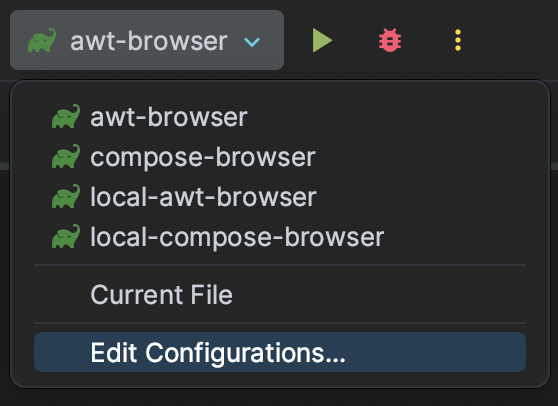

[](https://opensource.org/licenses/Apache-2.0)
# jcef-compose

Jcef-compose is a small API that offers the ability to embed a [CEF Browser](https://github.com/chromiumembedded/java-cef) as a [Composable](https://github.com/JetBrains/compose-multiplatform/blob/master/README.md?plain=1) targeting jvm.
The project was born because of [Swing interoperability](https://github.com/JetBrains/compose-multiplatform/tree/master/tutorials/Swing_Integration) limitations. 
Indeed, it is currently not possible to compose on top of a swing component ([#1521](https://github.com/JetBrains/compose-multiplatform/issues/1521), [#2926](https://github.com/JetBrains/compose-multiplatform/issues/2926)). 
Despite the fact that the OSR renderer does not highlight the power of CEF, this API should do the trick until the JetBrains team and other compose contributors provide an answer to this interoperability issue (they will, sure). In which case CEF windowed rendering will be preferable.

## Requirements

* Java 11 or later

## Supported platforms

* Windows, arm64 not supported
* macOS
* Linux

## Installation

TODO

## How to use

Simple example.

```kotlin 
fun main() = singleWindowApplication(title = "Jcef compose") {
    CefBrowser(
        url = remember { "https://github.com/Manriif/jcef-compose" },
        window = window,
        onClientAvailable = { cefClient ->
            configureClient(cefClient)
        },
        onBrowserAvailable = { cefBrowser ->
            configureBrowser(cefBrowser)
        }
    )
}
```

Other ready to run examples are available [here](example).\
These examples can be run on IntelliJ through run configurations.



Or as gradle tasks in the terminal:

* `./gradlew simple-browser`, minimal code to display a `CefBrowser`.
* `./gradlew advanced-browser`, a browser window with a composable bottom bar that interact with `CefBrowser`.
* `./gradlew local-browser`, render local HTML with CSS and JS files and display composable buttons that allow execution of JavaScript code through `CefBrowser`.

## Limitations

Jcef limitations applies to this project, see:

* [java-cef](https://github.com/chromiumembedded/java-cef/#readme)
* [jcefmaven](https://github.com/jcefmaven/jcefmaven#readme) 

## Contributing

Feel free to contribute!!


